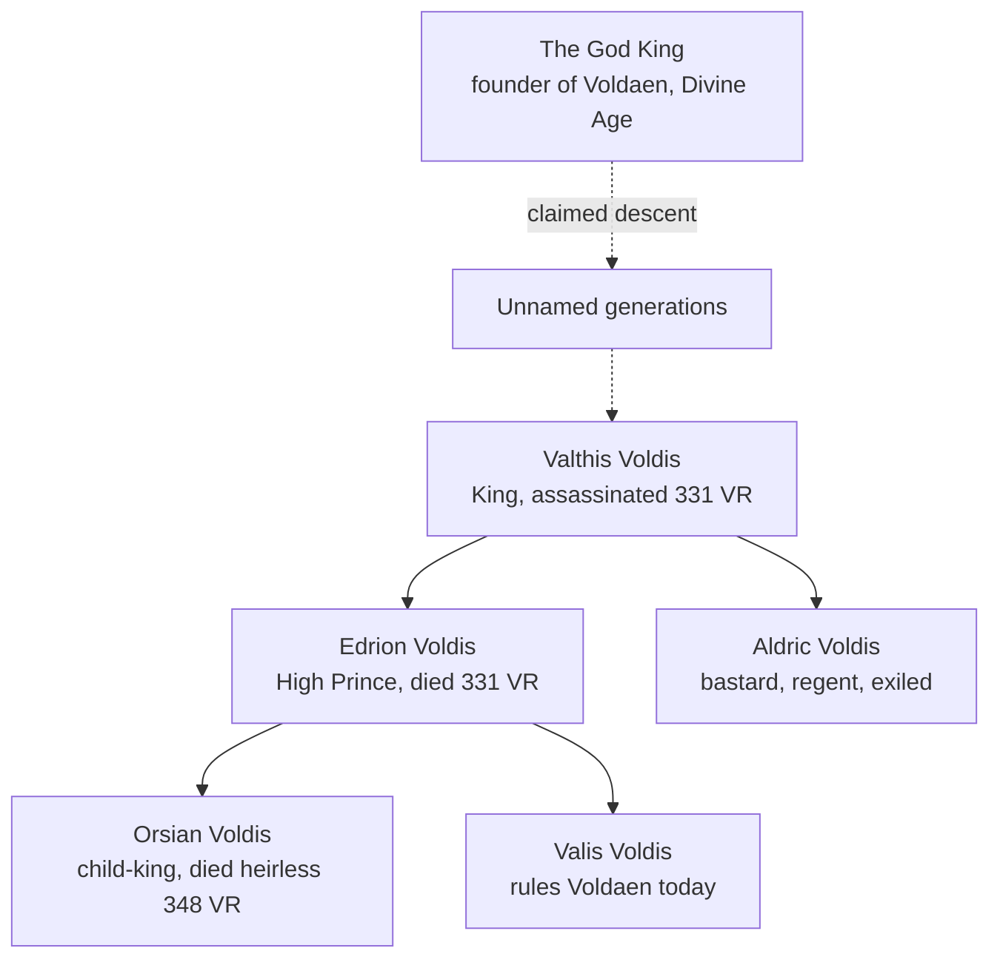

**Summary**: The royal dynasty of [[voldaen|Voldaen]], custodians of sacred inheritance, ruling by claimed divine descent from the God King of the Divine Age. Currently headed by [[valis-voldis|Valis Voldis]].

---

The House of Voldis has ruled [[voldaen|Voldaen]] since the nation's founding in the Divine Age. Its monarchs claim rule not by conquest or law, but by divine descent from the God King, and the family holds itself custodian of a sacred inheritance. The house is also known across Althas for holding many [[miracles|Miracles]] at once, the real source of Voldaen's strength.

## Family tree

> [!note] Reading the tree
> The dashed line marks the house's own claim of divine descent, rendered here exactly as the house presents it. No public record names the generations between the God King and [[valthis-voldis|Valthis Voldis]]; the gap is part of the historical record, not an omission of this page.

## The succession crisis

The modern line's story is the founding wound of the campaign's present day. In 331 VR the High Prince, [[edrion-voldis|Edrion Voldis]], died fighting the Ophanim as one of the Five Heroes. King [[valthis-voldis|Valthis Voldis]] was assassinated soon after by a killer Voldaen has never identified, remembered only as [[kingslayer|the Kingslayer]]. The crown passed to Edrion's sickly young son, [[orsian-voldis|Orsian Voldis]], before he was old enough to rule in his own name.

Edrion's will had named his bastard half-brother, [[aldric-voldis|Aldric Voldis]], regent for exactly this circumstance. Within a few years the capital's oldest noble families staged a quiet coup, stripped Aldric of his authority, and exiled him to the western borders. Orsian ruled as their puppet until he died heirless in 348 VR.

The capital houses backed his elder sister, [[valis-voldis|Valis Voldis]], insisting on unbroken succession, while the southern nobles answered with a rival claim for Aldric's return. The dispute spread far beyond the family, and out of that fracture came the revolution that founded [[jesthaen|Jesthaen]]. Valis rules Voldaen in the aftermath. See [[althas|Althas]] for the full telling.

## Related pages

- [[althas|Althas]]
- [[voldaen|Voldaen]]
- [[valthis-voldis|Valthis Voldis]]
- [[edrion-voldis|Edrion Voldis]]
- [[aldric-voldis|Aldric Voldis]]
- [[orsian-voldis|Orsian Voldis]]
- [[valis-voldis|Valis Voldis]]
- [[jesthaen|Jesthaen]]
- [[kingslayer|The Kingslayer]]
- [[miracles|Miracles]]
