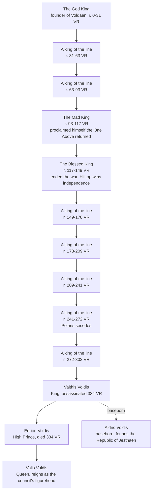

**Summary**: The royal dynasty of [[voldaen|Voldaen]], custodians of sacred inheritance, ruling by claimed divine descent from the God King of the Divine Age. Currently headed by [[valis-voldis|Valis Voldis]].

---

The House of Voldis has ruled [[voldaen|Voldaen]] since the nation's founding in the Divine Age. Its monarchs claim rule not by conquest or law, but by divine descent from the God King, and the family holds itself custodian of a sacred inheritance. The house is also known across Althas for holding many [[miracles|Miracles]] at once, the real source of Voldaen's strength.

## Family tree

> [!note] Reading the tree
> House Voldis rules by claimed divine descent from the God King, rendered here as the house presents it. The individual names of the deep dynasty are largely lost to record, marked here only as kings of the line, save the two reigns the histories could not forget: the Mad King and the Blessed King. The named line resumes with [[valthis-voldis|Valthis Voldis]]. The dashed line marks [[aldric-voldis|Aldric]]'s baseborn descent, acknowledged but never legitimized.

## The ancient line

Voldaen's crown has passed down the House of Voldis since the God King founded the nation at the close of the Divine Age. Most of that long line is remembered only as a succession of kings; two reigns the histories could not forget.

The first is the Mad King, who proclaimed himself the One Above returned to Althas. The Holy See named the claim heresy, and the realm broke into civil war between crown and church. The war ended under his successor, the Blessed King, who put down the Mad King, his own father, and denounced him before the faithful. Out of that settlement Hilltop, long the Holy See's own seat, won its full independence from the Voldis crown. Generations later, the scholars and mages of the north broke from Voldaen in their turn to found [[polaris|Polaris]].

## The succession crisis

The modern line's story is the founding wound of the campaign's present day. In 334 VR the High Prince, [[edrion-voldis|Edrion Voldis]], died fighting the Ophanim as one of the Five Heroes. King [[valthis-voldis|Valthis Voldis]] was assassinated soon after by a killer Voldaen has never identified, remembered only as [[kingslayer|the Kingslayer]]. Both deaths fell within a year, leaving Edrion's young daughter, [[valis-voldis|Valis Voldis]], the last heir of the direct line before she was old enough to rule.

Edrion's will had named his baseborn half-brother, [[aldric-voldis|Aldric Voldis]], her regent. The capital's oldest noble families would not accept a bastard's hand on the realm: they stripped him of the regency, exiled him to the western borders, and took power themselves, ruling in the child-queen's name. Aldric did not contest the throne. He carried his cause to the common people of the south instead, and over long years of exile built the movement that broke into revolution in 351 VR and founded the [[jesthaen|Republic of Jesthaen]], named for his mother, [[jestha|Jestha]].

Voldaen held, diminished, its southern half lost. Queen [[valis-voldis|Valis]] wears the crown to this day, though the council of houses that exiled Aldric governs beneath it. See [[index|Althas]] for the full telling.

## Related pages

- [[index|Althas]]
- [[voldaen|Voldaen]]
- [[valthis-voldis|Valthis Voldis]]
- [[edrion-voldis|Edrion Voldis]]
- [[aldric-voldis|Aldric Voldis]]
- [[valis-voldis|Valis Voldis]]
- [[jestha|Jestha]]
- [[jesthaen|Jesthaen]]
- [[kingslayer|The Kingslayer]]
- [[miracles|Miracles]]
- [[polaris|Polaris]]
