**Summary**: A map of how the five nations of [[althas|Althas]] and the powers within them stand toward each other, five years after the Jesthaen Treaty. It draws only on relationships already stated elsewhere in the wiki.

---

The decade of warfare that the Jesthaen Treaty ended in 358 VR left the continent divided and the peace uneasy. This page lays out where the five nations and their governing powers stand toward one another. Nodes link to their own pages.

```mermaid
graph LR
    VOL["Voldaen"]
    POL["Polaris"]
    ARM["Armada"]
    JES["Jesthaen"]
    HIL["Hilltop"]
    HSE["The Holy See"]
    CAN["Canton of Inquisition"]
    GLD["The Guild"]
    HVO["House Voldis"]
    INF["Infernis"]

    HVO -->|"royal dynasty, rules"| VOL
    HSE -->|"divine regent, governs the faith from"| HIL
    CAN -->|"investigative and judicial arm of"| HSE
    GLD -->|"governs"| ARM
    ARM -->|"sometimes tolerates"| INF

    VOL <-->|"rivals"| POL
    HIL -->|"sent aid in the rebellion"| VOL
    HSE -->|"allied in the rebellion"| VOL
    POL -->|"backed the rebels"| JES
    ARM -->|"backed the rebels"| JES
    POL <-->|"fragile wartime alliance"| ARM
    JES <-->|"revolution, then a tenuous peace"| VOL

    click VOL "../locations/voldaen" "Voldaen"
    click POL "../locations/polaris" "Polaris"
    click ARM "../locations/armada" "Armada"
    click JES "../locations/jesthaen" "Jesthaen"
    click HIL "../locations/hilltop" "Hilltop"
    click HSE "../organizations/the-holy-see" "The Holy See"
    click CAN "../organizations/canton-of-inquisition" "Canton of Inquisition"
    click GLD "../organizations/guild" "The Guild"
    click HVO "../organizations/house-voldis" "House Voldis"
    click INF "../ancestries/infernis" "Infernis"
```

## The two sides of the war

The fighting that the Jesthaen Treaty ended had two sides. [[voldaen|Voldaen]] held the old monarchy, [[hilltop|Hilltop]] sent aid to it, and [[the-holy-see|the Holy See]] stood with it as well. Against them stood [[jesthaen|Jesthaen]], the republic that had broken away from Voldaen during the Voldis Succession Crisis, with [[polaris|Polaris]] and [[armada|Armada]] backing the rebels. The treaty stopped active combat in 358 VR without resolving what had caused it, and the peace between Voldaen and Jesthaen remains tenuous.

## Rivalries and alliances

[[voldaen|Voldaen]] and [[polaris|Polaris]] were rivals before the war and stayed rivals through it. Polaris began as a group of scholars and mages who broke away from Hilltop, and it sided with the rebels against Voldaen's monarchy. Its alliance with [[armada|Armada]] and Jesthaen carried them through the fighting, but with the common enemy gone that alliance is now called fragile.

## Who governs whom

Several powers on the map are not nations but the institutions that run them. [[house-voldis|House Voldis]] is the royal dynasty of Voldaen. [[the-holy-see|The Holy See]] governs the faith from Hilltop and fields the [[canton-of-inquisition|Canton of Inquisition]] as its investigative and judicial arm. [[armada|Armada]] answers to [[guild|the Guild]] rather than to any single ruler. Armada is also the one nation that sometimes tolerates the [[infernis|Infernis]], who are banned almost everywhere else.

## Related pages

- [[althas|Althas]]
- [[voldaen|Voldaen]]
- [[polaris|Polaris]]
- [[armada|Armada]]
- [[jesthaen|Jesthaen]]
- [[hilltop|Hilltop]]
- [[the-holy-see|The Holy See]]
- [[canton-of-inquisition|Canton of Inquisition]]
- [[guild|The Guild]]
- [[house-voldis|House Voldis]]
- [[infernis|Infernis]]
