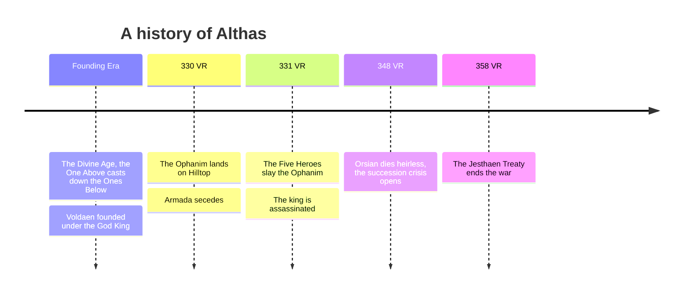

**Summary**: A chronology of Althas, from the Divine Age to the [[jesthaen|Jesthaen]] Treaty of 358 VR. It gathers the dated history already recorded across the wiki into one view; the [[calendar|Calendar]] page explains how the years are counted.

---

The years of Althas are numbered in the Voldaen Reckoning (VR), counted from the founding of [[voldaen|Voldaen]] at the close of the Divine Age. The diagram gathers the major turning points; the prose below carries the detail and the links.

## Founding Era

Althas once flew under a single banner. In the Divine Age [[the-one-above|the One Above]] protected the continent's mortal creations and fought [[the-ones-below|the Ones Below]], the primordial powers of chaos, and struck them down. The war ended when the One Above cast the Ones Below down and sealed them away, and that blow left the crater that became [[crater-lake|the Crater Lake]] at the center of Althas. With victory secured, the people crowned their first God King and founded [[voldaen|Voldaen]]. The One Above set their seat at what is now [[hilltop|Hilltop]] and departed soon after for reasons no one records. In their absence [[the-holy-see|the Holy See]] took up authority as divine regent, and later a group of scholars and mages broke away to found [[polaris|Polaris]].

## 330 VR

[[the-ophanim|The Ophanim]] landed in central Hilltop and rendered much of the region uninhabitable. The Holy See and its refugees relocated to central Althas, and the merchant lords of the southern trade cities used the upheaval to declare independence as [[armada|Armada]].

## 331 VR

The Five Heroes brought the Ophanim down. Among them, the Voldaen High Prince [[edrion-voldis|Edrion Voldis]] and Saint Cassio of the Holy See died in the fighting. Soon after, King [[valthis-voldis|Valthis Voldis]] was assassinated by a killer Voldaen has never identified, and the crown passed to Edrion's sickly young son [[orsian-voldis|Orsian Voldis]] before he was old enough to rule in his own name.

## 348 VR

Orsian died without heirs. The capital's noble houses backed his elder sister [[valis-voldis|Valis Voldis]] for unbroken succession, while the southern nobles called for the return of the exiled [[aldric-voldis|Aldric Voldis]]. The dispute spread far past [[house-voldis|House Voldis]] and hardened into a revolution, and out of that fracture came [[jesthaen|Jesthaen]], first a rebellion and then a republic.

## 358 VR

Active combat ran for the better part of a decade, with Hilltop aiding Voldaen while Polaris and Armada backed the Jesthaen rebels. It ended in 358 VR with the Holy See's ratification of the Jesthaen Treaty, though the peace between Voldaen and Jesthaen remains tenuous. The [[diplomacy|Diplomacy]] page maps where the powers stand five years on.

## Related pages

- [[calendar|Calendar]]
- [[index|Althas]]
- [[diplomacy|Diplomacy]]
- [[the-one-above|The One Above]]
- [[the-ones-below|The Ones Below]]
- [[crater-lake|Crater Lake]]
- [[voldaen|Voldaen]]
- [[hilltop|Hilltop]]
- [[polaris|Polaris]]
- [[the-holy-see|The Holy See]]
- [[the-ophanim|The Ophanim]]
- [[armada|Armada]]
- [[edrion-voldis|Edrion Voldis]]
- [[valthis-voldis|Valthis Voldis]]
- [[orsian-voldis|Orsian Voldis]]
- [[valis-voldis|Valis Voldis]]
- [[aldric-voldis|Aldric Voldis]]
- [[house-voldis|House Voldis]]
- [[jesthaen|Jesthaen]]
