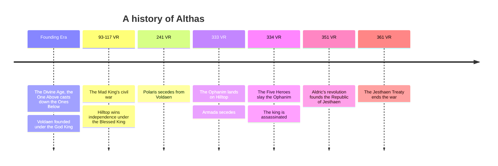

**Summary**: A chronology of Althas, from the Divine Age to the [[jesthaen|Jesthaen]] Treaty of 361 VR. It gathers the dated history already recorded across the wiki into one view; the [[calendar|Calendar]] page explains how the years are counted.

---

The years of Althas are numbered in the Voldaen Reckoning (VR), counted from the founding of [[voldaen|Voldaen]] at the close of the Divine Age. The diagram gathers the major turning points; the prose below carries the detail and the links.

## Founding Era

Althas once flew under a single banner. In the Divine Age [[the-one-above|the One Above]] protected the continent's mortal creations and fought [[the-ones-below|the Ones Below]], the primordial powers of chaos, and struck them down. The war ended when the One Above cast the Ones Below down and sealed them away, and that blow left the crater that became [[crater-lake|the Crater Lake]] at the center of Althas. With victory secured, the people crowned their first God King and founded [[voldaen|Voldaen]]. The One Above set their seat at what is now [[hilltop|Hilltop]] and departed soon after for reasons no one records. In their absence [[the-holy-see|the Holy See]] took up authority as divine regent, and later a group of scholars and mages broke away to found [[polaris|Polaris]].

## The Mad King's War (93-117 VR)

Generations after the founding, the king remembered as the Mad King proclaimed himself [[the-one-above|the One Above]] returned in the flesh. [[the-holy-see|The Holy See]] named the claim heresy, and crown and church fell into open civil war, the first fracture of a continent that had flown under one banner since the Divine Age. It ended in 117 VR when his own son and successor, the Blessed King, struck him down and denounced him before the faithful. Out of that settlement [[hilltop|Hilltop]] won full independence from the Voldis crown. See [[house-voldis|House Voldis]] for the dynasty across these reigns.

## 241 VR

The scholars and mages of the north, grown into a power of their own, broke away from [[voldaen|Voldaen]] by negotiated partition rather than repeat the last war's bloodshed, founding [[polaris|Polaris]] under its Triumvirate of Archmages.

## 333 VR

[[the-ophanim|The Ophanim]] landed in central Hilltop and rendered much of the region uninhabitable. The Holy See and its refugees relocated to central Althas, and the merchant lords of the southern trade cities used the upheaval to declare independence as [[armada|Armada]].

## 334 VR

The Five Heroes brought the Ophanim down. Among them, the Voldaen High Prince [[edrion-voldis|Edrion Voldis]] and Saint Cassio of the Holy See died in the fighting. Soon after, King [[valthis-voldis|Valthis Voldis]] was assassinated by a killer Voldaen has never identified, leaving Edrion's young daughter [[valis-voldis|Valis Voldis]] the last heir of the direct line before she was old enough to rule.

## 351 VR

The capital's noble houses had driven the baseborn regent [[aldric-voldis|Aldric Voldis]] into exile and ruled through the child-queen [[valis-voldis|Valis Voldis]] in his place. Aldric carried his cause to the common people of the south, and the movement he built there hardened into revolution. Out of that fracture came [[jesthaen|Jesthaen]], first a rebellion and then a republic, named for Aldric's mother and the first nation of Althas to reject the divine right of [[house-voldis|House Voldis]].

## 361 VR

Active combat ran for the better part of a decade, with Hilltop aiding Voldaen while Polaris and Armada backed the Jesthaen rebels. It ended in 361 VR with the Holy See's ratification of the Jesthaen Treaty, though the peace between Voldaen and Jesthaen remains tenuous. The [[diplomacy|Diplomacy]] page maps where the powers stand five years on.

## Related pages

- [[calendar|Calendar]]
- [[chronicle|Chronicle]]
- [[index|Althas]]
- [[diplomacy|Diplomacy]]
- [[the-one-above|The One Above]]
- [[the-ones-below|The Ones Below]]
- [[crater-lake|Crater Lake]]
- [[voldaen|Voldaen]]
- [[hilltop|Hilltop]]
- [[polaris|Polaris]]
- [[the-holy-see|The Holy See]]
- [[the-ophanim|The Ophanim]]
- [[armada|Armada]]
- [[edrion-voldis|Edrion Voldis]]
- [[valthis-voldis|Valthis Voldis]]
- [[valis-voldis|Valis Voldis]]
- [[aldric-voldis|Aldric Voldis]]
- [[house-voldis|House Voldis]]
- [[the-god-king|The God King]]
- [[the-mad-king|The Mad King]]
- [[the-blessed-king|The Blessed King]]
- [[jesthaen|Jesthaen]]
